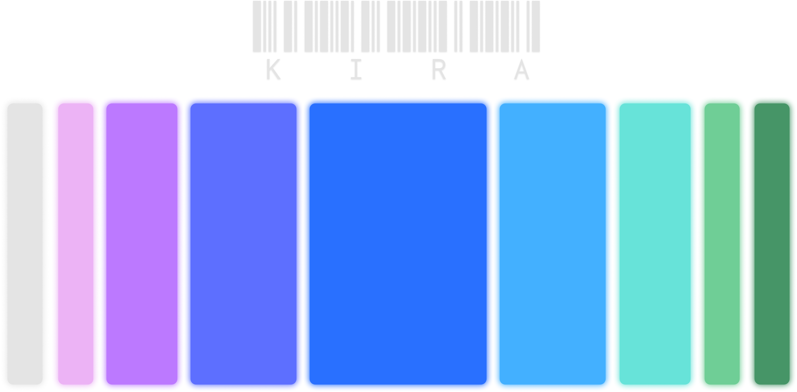

    <h1>Kira Color Palette</h1>
    

## Colors Preview

### Tones

### Shades and Tints

### UI Color Scales

## Colors codes

| Name    | Hex       | RGB             |
|---------|-----------|-----------------|
| Base-1  | `#E5E5E5` | `229, 229, 229` |
| Base-2  | `#ECB3F5` | `236, 179, 245` |
| Base-3  | `#BC79FF` | `188, 121, 255` |
| Base-4  | `#5D6FFF` | `93, 111, 255`  |
| Base-5  | `#2970FF` | `41, 112, 255`  |
| Base-6  | `#43B0FF` | `67, 176, 255`  |
| Base-7  | `#67E3D9` | `103, 227, 217` |
| Base-8  | `#6FCE96` | `111, 206, 150` |
| Base-9  | `#469567` | `70, 149, 103`  |

## Dark Colors

| Name     | Hex       | RGB             |
|----------|-----------|-----------------|
| Dark-1   | `#8D8D8D` | `141, 141, 141` |
| Dark-2   | `#926F97` | `146, 111, 151` |
| Dark-3   | `#754D9D` | `117, 77, 157`  |
| Dark-4   | `#3C479D` | `60, 71, 157`   |
| Dark-5   | `#1D479D` | `29, 71, 157`   |
| Dark-6   | `#2C6E9D` | `44, 110, 157`  |
| Dark-7   | `#428C86` | `66, 140, 134`  |
| Dark-8   | `#47805E` | `71, 128, 94`   |
| Dark-9   | `#2E5D42` | `46, 93, 66`    |

## Cyberspace Void Black Scale

| Name       | Hex       | RGB             |
|------------|-----------|-----------------|
| Black-100  | `#0A0A0A` | `10, 10, 10`    |
| Black-200  | `#242424` | `36, 36, 36`    |
| Black-300  | `#3D3D3D` | `61, 61, 61`    |
| Black-400  | `#575757` | `87, 87, 87`    |
| Black-500  | `#707070` | `112, 112, 112` |
| Black-600  | `#8A8A8A` | `138, 138, 138` |
| Black-700  | `#A3A3A3` | `163, 163, 163` |
| Black-800  | `#BCBCBC` | `188, 188, 188` |
| Black-900  | `#D6D6D6` | `214, 214, 214` |
| Black-1000 | `#F0F0F0` | `240, 240, 240` |

## Interface Bluish Scale

| Name          | Hex       | RGB             |
|---------------|-----------|-----------------|
| Bluish-100    | `#0C0C10` | `12, 12, 16`    |
| Bluish-200    | `#22222D` | `34, 34, 45`    |
| Bluish-300    | `#38384A` | `56, 56, 74`    |
| Bluish-400    | `#4E4E67` | `78, 78, 103`   |
| Bluish-500    | `#636385` | `99, 99, 133`   |
| Bluish-600    | `#7D7D9E` | `125, 125, 158` |
| Bluish-700    | `#9A9AB4` | `154, 154, 180` |
| Bluish-800    | `#B8B8C9` | `184, 184, 201` |
| Bluish-900    | `#D5D5DF` | `213, 213, 223` |
| Bluish-1000   | `#F2F2F5` | `242, 242, 245` |

## Tones

### Paper Scale
| Hex       | RGB             |
|-----------|-----------------|
| `#E5E5E5` | `229, 229, 229` |
| `#DADADA` | `218, 218, 218` |
| `#CFCFCF` | `207, 207, 207` |
| `#C3C3C3` | `195, 195, 195` |
| `#B9B9B9` | `185, 185, 185` |
| `#AEAEAE` | `174, 174, 174` |
| `#A3A3A3` | `163, 163, 163` |
| `#989898` | `152, 152, 152` |
| `#8D8D8D` | `141, 141, 141` |
| `#828282` | `130, 130, 130` |

### Pink Scale
| Hex       | RGB             |
|-----------|-----------------|
| `#ECB3F5` | `236, 179, 245` |
| `#E0ADE8` | `224, 173, 232` |
| `#D4A7DB` | `212, 167, 219` |
| `#C8A1CF` | `200, 161, 207` |
| `#BD9BC2` | `189, 155, 194` |
| `#B195B6` | `177, 149, 182` |
| `#A58FA9` | `165, 143, 169` |
| `#9A899C` | `154, 137, 156` |
| `#8E8390` | `142, 131, 144` |
| `#827D83` | `130, 125, 131` |

### Magenta Scale
| Hex       | RGB             |
|-----------|-----------------|
| `#BC79FF` | `188, 121, 255` |
| `#B578F1` | `181, 120, 241` |
| `#AE78E3` | `174, 120, 227` |
| `#A778D6` | `167, 120, 214` |
| `#A078C8` | `160, 120, 200` |
| `#9978BB` | `153, 120, 187` |
| `#9277AD` | `146, 119, 173` |
| `#8B779F` | `139, 119, 159` |
| `#847792` | `132, 119, 146` |
| `#7D7784` | `125, 119, 132` |

### Violet Scale
| Hex       | RGB             |
|-----------|-----------------|
| `#5D6FFF` | `93, 111, 255`  |
| `#5F6FF1` | `95, 111, 241`  |
| `#6270E3` | `98, 112, 227`  |
| `#6471D6` | `100, 113, 214` |
| `#6772C8` | `103, 114, 200` |
| `#6A73BB` | `106, 115, 187` |
| `#6C73AD` | `108, 115, 173` |
| `#6F749F` | `111, 116, 159` |
| `#717592` | `113, 117, 146` |
| `#747684` | `116, 118, 132` |

### Blue Scale
| Hex       | RGB             |
|-----------|-----------------|
| `#2970FF` | `41, 112, 255`  |
| `#3070F1` | `48, 112, 241`  |
| `#3871E3` | `56, 113, 227`  |
| `#4072D6` | `64, 114, 214`  |
| `#4872C8` | `72, 114, 200`  |
| `#5073BB` | `80, 115, 187`  |
| `#5774AD` | `87, 116, 173`  |
| `#5F749F` | `95, 116, 159`  |
| `#677592` | `103, 117, 146` |
| `#6F7684` | `111, 118, 132` |

### Celeste Scale
| Hex       | RGB             |
|-----------|-----------------|
| `#43B0FF` | `67, 176, 255`  |
| `#48AAF1` | `72, 170, 241`  |
| `#4DA4E3` | `77, 164, 227`  |
| `#529ED6` | `82, 158, 214`  |
| `#5799C8` | `87, 153, 200`  |
| `#5D93BB` | `93, 147, 187`  |
| `#628DAD` | `98, 141, 173`  |
| `#67889F` | `103, 136, 159` |
| `#6C8292` | `108, 130, 146` |
| `#717C84` | `113, 124, 132` |

### Cyan Scale
| Hex       | RGB             |
|-----------|-----------------|
| `#67E3D9` | `103, 227, 217` |
| `#68D8CF` | `104, 216, 207` |
| `#6ACDC5` | `106, 205, 197` |
| `#6BC2BB` | `107, 194, 187` |
| `#6DB7B1` | `109, 183, 177` |
| `#6FADA8` | `111, 173, 168` |
| `#70A29E` | `112, 162, 158` |
| `#729794` | `114, 151, 148` |
| `#738C8A` | `115, 140, 138` |
| `#758180` | `117, 129, 128` |

### Green Scale
| Hex       | RGB             |
|-----------|-----------------|
| `#6FCE96` | `111, 206, 150` |
| `#6FC592` | `111, 197, 146` |
| `#70BC8F` | `112, 188, 143` |
| `#71B38C` | `113, 179, 140` |
| `#72AB89` | `114, 171, 137` |
| `#73A286` | `115, 162, 134` |
| `#739983` | `115, 153, 131` |
| `#749180` | `116, 145, 128` |
| `#75887D` | `117, 136, 125` |
| `#767F7A` | `118, 127, 122` |

### Forest Scale
| Hex       | RGB             |
|-----------|-----------------|
| `#469567` | `70, 149, 103`  |
| `#4A9268` | `74, 146, 104`  |
| `#4F8F6A` | `79, 143, 106`  |
| `#548C6B` | `84, 140, 107`  |
| `#59896D` | `89, 137, 109`  |
| `#5E866F` | `94, 134, 111`  |
| `#638370` | `99, 131, 112`  |
| `#688072` | `104, 128, 114` |
| `#6D7D73` | `109, 125, 115` |
| `#727A75` | `114, 122, 117` |

## Shades and Tints

### Paper ST
| Tints (Claros)       | Shades (Oscuros)  |
|----------------------|-------------------|
| `#E7E7E7`           | `#CECECE`         |
| `#EAEAEA`           | `#B7B7B7`         |
| `#ECECEC`           | `#A0A0A0`         |
| `#EFEFEF`           | `#898989`         |
| `#F2F2F2`           | `#727272`         |
| `#F4F4F4`           | `#5B5B5B`         |
| `#F7F7F7`           | `#444444`         |
| `#F9F9F9`           | `#2D2D2D`         |
| `#FCFCFC`           | `#161616`         |

### Pink ST
| Tints (Claros)       | Shades (Oscuros)  |
|----------------------|-------------------|
| `#EDBAF6`           | `#D4A1DC`         |
| `#EFC2F7`           | `#BC8FC4`         |
| `#F1C9F8`           | `#A57DAB`         |
| `#F3D1F9`           | `#8D6B93`         |
| `#F5D9FA`           | `#76597A`         |
| `#F7E0FB`           | `#5E4762`         |
| `#F9E8FC`           | `#463549`         |
| `#FBEFFD`           | `#2F2330`         |
| `#FDF7FE`           | `#171118`         |

### Magenta ST
| Tints (Claros)       | Shades (Oscuros)  |
|----------------------|-------------------|
| `#C286FF`           | `#A96CE5`         |
| `#C993FF`           | `#9660CC`         |
| `#D0A1FF`           | `#8354B2`         |
| `#D6AEFF`           | `#704899`         |
| `#DDBCFF`           | `#5E3C7F`         |
| `#E4C9FF`           | `#4B3066`         |
| `#EAD6FF`           | `#38244C`         |
| `#F1E4FF`           | `#251832`         |
| `#F8F1FF`           | `#120C19`         |

### Violet ST
| Tints (Claros)       | Shades (Oscuros)  |
|----------------------|-------------------|
| `#6D7DFF`           | `#5363E5`         |
| `#7D8BFF`           | `#4A58CC`         |
| `#8D9AFF`           | `#414DB2`         |
| `#9DA8FF`           | `#374299`         |
| `#AEB7FF`           | `#2E377F`         |
| `#BEC5FF`           | `#252C66`         |
| `#CED3FF`           | `#1B214C`         |
| `#DEE2FF`           | `#121632`         |
| `#EEF0FF`           | `#090B19`         |

### Blue ST
| Tints (Claros)       | Shades (Oscuros)  |
|----------------------|-------------------|
| `#3E7EFF`           | `#2464E5`         |
| `#538CFF`           | `#2059CC`         |
| `#699AFF`           | `#1C4EB2`         |
| `#7EA9FF`           | `#184399`         |
| `#94B7FF`           | `#14387F`         |
| `#A9C5FF`           | `#102C66`         |
| `#BED4FF`           | `#0C214C`         |
| `#D4E2FF`           | `#081632`         |
| `#E9F0FF`           | `#040B19`         |

### Celeste ST
| Tints (Claros)       | Shades (Oscuros)  |
|----------------------|-------------------|
| `#55B7FF`           | `#3C9EE5`         |
| `#68BFFF`           | `#358CCC`         |
| `#7BC7FF`           | `#2E7BB2`         |
| `#8ECFFF`           | `#286999`         |
| `#A1D7FF`           | `#21587F`         |
| `#B3DFFF`           | `#1A4666`         |
| `#C6E7FF`           | `#14344C`         |
| `#D9EFFF`           | `#0D2332`         |
| `#ECF7FF`           | `#061119`         |

### Cyan ST
| Tints (Claros)       | Shades (Oscuros)  |
|----------------------|-------------------|
| `#76E5DC`           | `#5CCCC3`         |
| `#85E8E0`           | `#52B5AD`         |
| `#94EBE4`           | `#489E97`         |
| `#A3EEE8`           | `#3D8882`         |
| `#B3F1EC`           | `#33716C`         |
| `#C2F3EF`           | `#295A56`         |
| `#D1F6F3`           | `#1E4441`         |
| `#E0F9F7`           | `#142D2B`         |
| `#EFFCFB`           | `#0A1615`         |

### Green ST
| Tints (Claros)       | Shades (Oscuros)  |
|----------------------|-------------------|
| `#7DD2A0`           | `#63B987`         |
| `#8BD7AB`           | `#58A478`         |
| `#9ADCB5`           | `#4D9069`         |
| `#A8E1C0`           | `#427B5A`         |
| `#B7E6CA`           | `#37674B`         |
| `#C5EBD5`           | `#2C523C`         |
| `#D3F0DF`           | `#213D2D`         |
| `#E2F5EA`           | `#16291D`         |
| `#F0FAF4`           | `#0B140E`         |

### Forest ST
| Tints (Claros)       | Shades (Oscuros)  |
|----------------------|-------------------|
| `#589F76`           | `#3F865C`         |
| `#6BAA85`           | `#387752`         |
| `#7DB494`           | `#316848`         |
| `#90BFA3`           | `#2A593D`         |
| `#A2CAB3`           | `#234A33`         |
| `#B5D4C2`           | `#1C3B29`         |
| `#C7DFD1`           | `#152C1E`         |
| `#DAE9E0`           | `#0D1D14`         |
| `#ECF4EF`           | `#060E0A`         |

## UI Color Scales

### Neutral UI
| Hex       | RGB             |
|-----------|-----------------|
| `#FDFDFD` | `253, 253, 253` |
| `#F8F8F8` | `248, 248, 248` |
| `#F3F3F3` | `243, 243, 243` |
| `#EEEEEE` | `238, 238, 238` |
| `#E9E9E9` | `233, 233, 233` |
| `#E5E5E5` | `229, 229, 229` |
| `#B7B7B7` | `183, 183, 183` |
| `#898989` | `137, 137, 137` |
| `#5B5B5B` | `91, 91, 91`    |
| `#2D2D2D` | `45, 45, 45`    |

### Pink UI
| Hex       | RGB             |
|-----------|-----------------|
| `#FDFBFE` | `253, 251, 254` |
| `#F9EDFC` | `249, 237, 252` |
| `#F5DFF9` | `245, 223, 249` |
| `#F1D1F7` | `241, 209, 247` |
| `#EDC3F5` | `237, 195, 245` |
| `#EAB5F3` | `234, 181, 243` |
| `#BB90C2` | `187, 144, 194` |
| `#8C6C91` | `140, 108, 145` |
| `#5D4861` | `93, 72, 97`    |
| `#2E2430` | `46, 36, 48`    |

### Magenta UI
| Hex       | RGB             |
|-----------|-----------------|
| `#FBF8FE` | `251, 248, 254` |
| `#EEDFFE` | `238, 223, 254` |
| `#E2C6FD` | `226, 198, 253` |
| `#D5ADFD` | `213, 173, 253` |
| `#C894FC` | `200, 148, 252` |
| `#BC7CFC` | `188, 124, 252` |
| `#9663C9` | `150, 99, 201`  |
| `#704A97` | `112, 74, 151`  |
| `#4B3164` | `75, 49, 100`   |
| `#251832` | `37, 24, 50`    |

### Violet UI
| Hex       | RGB             |
|-----------|-----------------|
| `#F7F7FE` | `247, 247, 254` |
| `#D9DDFE` | `217, 221, 254` |
| `#BBC2FD` | `187, 194, 253` |
| `#9DA7FC` | `157, 167, 252` |
| `#7F8CFB` | `127, 140, 251` |
| `#6172FB` | `97, 114, 251`  |
| `#4D5BC8` | `77, 91, 200`   |
| `#3A4496` | `58, 68, 150`   |
| `#262D64` | `38, 45, 100`   |
| `#131632` | `19, 22, 50`    |

### Blue UI
| Hex       | RGB             |
|-----------|-----------------|
| `#F4F7FE` | `244, 247, 254` |
| `#CCDDFD` | `204, 221, 253` |
| `#A5C2FC` | `165, 194, 252` |
| `#7DA7FB` | `125, 167, 251` |
| `#558CFA` | `85, 140, 250`  |
| `#2E72FA` | `46, 114, 250`  |
| `#245BC8` | `36, 91, 200`   |
| `#1B4496` | `27, 68, 150`   |
| `#122D64` | `18, 45, 100`   |
| `#091631` | `9, 22, 49`     |

### Celeste UI
| Hex       | RGB             |
|-----------|-----------------|
| `#F5FBFE` | `245, 251, 254` |
| `#D3EBFD` | `211, 235, 253` |
| `#B0DCFC` | `176, 220, 252` |
| `#8DCFFB` | `141, 207, 251` |
| `#6ABEFA` | `106, 190, 250` |
| `#48AFFA` | `72, 175, 250`  |
| `#398CC8` | `57, 140, 200`  |
| `#2B6996` | `43, 105, 150`  |
| `#1C4664` | `28, 70, 100`   |
| `#0E2231` | `14, 34, 49`    |

### Cyan UI
| Hex       | RGB             |
|-----------|-----------------|
| `#F7FDFD` | `247, 253, 253` |
| `#DAF8F5` | `218, 248, 245` |
| `#BDF2EE` | `189, 242, 238` |
| `#A0EDE7` | `160, 237, 231` |
| `#83E8E0` | `131, 232, 224` |
| `#67E3D9` | `103, 227, 217` |
| `#52B5AD` | `82, 181, 173`  |
| `#3D8882` | `61, 136, 130`  |
| `#295A56` | `41, 90, 86`    |
| `#142D2B` | `20, 45, 43`    |

### Green UI
| Hex       | RGB             |
|-----------|-----------------|
| `#F7FCF9` | `247, 252, 249` |
| `#DCF3E5` | `220, 243, 229` |
| `#C1E9D1` | `193, 233, 209` |
| `#A5E0BD` | `165, 224, 189` |
| `#8AD7A9` | `138, 215, 169` |
| `#6FCE96` | `111, 206, 150` |
| `#58A478` | `88, 164, 120`  |
| `#427B5A` | `66, 123, 90`   |
| `#2C523C` | `44, 82, 60`    |
| `#16291D` | `22, 41, 29`    |

### Forest UI
| Hex       | RGB             |
|-----------|-----------------|
| `#F5F9F7` | `245, 249, 247` |
| `#D2E5DA` | `210, 229, 218` |
| `#AFD1BD` | `175, 209, 189` |
| `#8CBDA0` | `140, 189, 160` |
| `#69A983` | `105, 169, 131` |
| `#469567` | `70, 149, 103`  |
| `#387752` | `56, 119, 82`   |
| `#2A593D` | `42, 89, 61`    |
| `#1C3B29` | `28, 59, 41`    |
| `#0D1D14` | `13, 29, 20`    |
## Contributing
This color scheme is MIT licensed. Feel free to use and adapt it for any project. Please include attribution and link to [example.com/color-scheme](https://example.com/color-scheme).